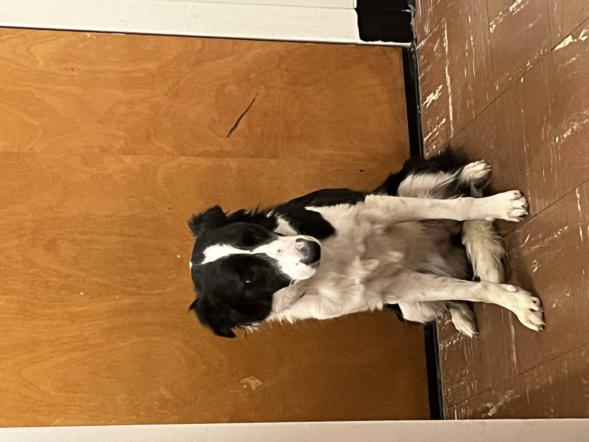

# This is Yingting's awesome website

Here's a git of elmo


# HERE' S A NEW SESSION

My dog is Cappu. This is Cappu:



Also here's the "backstage" are in Alumi 

you can add text

 * and lists
 * with extra bullets
 
 You can *FORMAT* and **bold**
 
 
 This is a [link](https://www.google.com/) to a good data science tool. Here is a link to [p8105](https://p8105.com/). Here's a link to the [about](about.html) page
 
 
 You can also still use R!
 
```{r}
library(tidyverse)
plot_df=
  tibble(
    x = runif(100),
    y = 1+2*x+rnorm(100)
  )

plot_df |> 
  ggplot(aes(x = x, y = y))+geom_point()
  
```
 
 